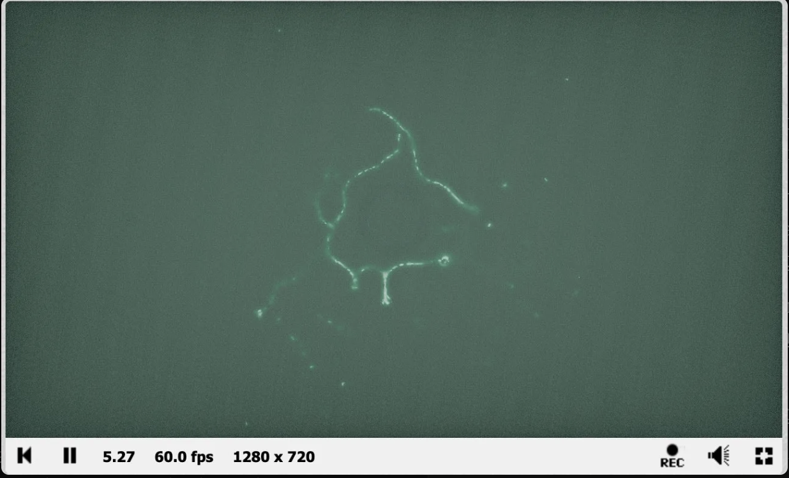
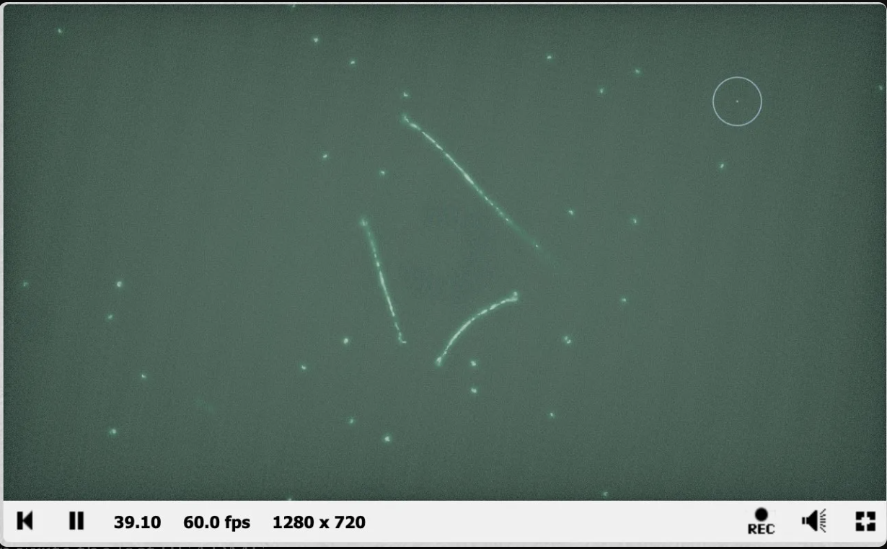

# Xenomycelium
### Coupled Multi-Agent Physarum Simulation + Gray-Scott Reaction-Diffusion · Real-Time GLSL Shader

*Early phase — sparse tendrils radiating from spawn ring*

*Mature phase — stigmergic feedback reinforces stable highway corridors*

[**View Live on Shadertoy →**](https://www.shadertoy.com/view/ffjGRh)

---

## Overview

Xenomycelium is a coupled multi-agent system in which a population of Physarum-inspired agents colonizes a chemically dynamic environment governed by a Gray-Scott reaction-diffusion model. Agents follow a stigmergic communication strategy — depositing pheromone trails into a shared texture, sensing those trails at three forward-pointing locations, and steering toward the highest combined score of trail density and local nutrient availability.

The result is an emergent bioluminescent network whose topology is jointly determined by agent behaviour and the shifting chemical landscape beneath it. No network structure is predefined — every highway, tendril, and rerouting event emerges from local rules operating at scale.

---

## Why This Matters Beyond Visuals

This project is a direct implementation of **decentralized intelligence** — one of the core research questions in AI safety and multi-agent systems.

The agents in Xenomycelium have no global map, no central coordinator, and no explicit instructions about what network to build. They produce complex, adaptive, globally coherent structure purely through local sensing and stigmergic feedback. This is structurally identical to the question of how large language models develop emergent capabilities that were not explicitly trained — and how those capabilities can be understood, predicted, or disrupted.

The rerouting behavior observed when chemical terrain shifts — where established highways partially dissolve and reconverge along new corridors — directly mirrors questions about how AI systems adapt to distributional shift, and whether that adaptation is robust or brittle.

---

## System Architecture

| Buffer | Role |
|--------|------|
| **Buffer A** | Agent state — each texel encodes one agent as `(pos.x, pos.y, angle, alive)` |
| **Buffer B** | Gray-Scott reaction-diffusion — two-chemical system (U, V) producing self-organizing terrain |
| **Buffer C** | Pheromone trail map — shared stigmergic memory; trails diffuse and evaporate each frame |
| **Image** | Composite rendering — bloom, chromatic aberration, vignette, film grain, bioluminescent colour grading |

---

## Key Technical Challenge

A significant engineering problem arose from coupling the two systems: because the RD field and the pheromone trail map both evolve on the same spatial grid, early implementations produced runaway positive feedback — heavy pheromone deposits suppressed the Gray-Scott V reactant, collapsing the RD pattern into uniform equilibrium within a few hundred frames.

**Resolution:** Strict decoupling of the two fields into separate render buffers — Buffer B for RD chemicals, Buffer C for trail map — ensuring agents read from both fields independently without writing back to the RD buffer during trail updates. Pheromone information informs agent steering without directly interfering with chemical dynamics, preserving Gray-Scott integrity while allowing indirect interaction through agent position.

This problem — preventing feedback between coupled subsystems from causing catastrophic collapse — is structurally analogous to alignment challenges in systems where multiple AI components interact.

---

## Interaction

- **Left-click / drag** — injects a nutrient burst at the cursor; agents swarm toward it and grow new branches in that direction

**Tunable parameters in BufferA:**

| Parameter | Effect |
|-----------|--------|
| `SENSE_ANGLE` | Wider angles create bushier, less directed networks |
| `SENSE_DIST` | Longer sensing creates longer bridge arcs |
| `TURN_SPEED` | Higher values cause tighter spirals |
| `DEPOSIT_AMOUNT` | More deposit = thicker, brighter trails |

**In BufferB:**
- `FEED_RATE` / `KILL_RATE` — controls Gray-Scott pattern morphology (try F=0.055, K=0.062)

---

## Emergent Behaviors

Over longer simulation runs the system exhibits several distinct emergent phases:

1. **Exploratory tendrils** — thin radiating filaments from the spawn ring
2. **Highway reinforcement** — stigmergic feedback amplifies frequently-travelled paths into stable high-density corridors
3. **Terrain-driven rerouting** — shifting RD zones undercut existing highways, triggering partial dissolution and reconvergence along new paths
4. **Network stabilization** — mature topology reflects the accumulated history of agent decisions and chemical terrain

---

## Future Extensions

- Agent specialization: scout vs. worker populations with differentiated sensing parameters
- Third signalling chemical simulating action-potential propagation along mycelial highways
- Adaptive spawn rate: more agents recruited when trail density is low
- 3D raymarched volume for full spatial immersion

---

## References

Jones, J. (2010). Characteristics of pattern formation and evolution in approximations of Physarum transport networks. *Artificial Life, 16*(2), 127–153. https://doi.org/10.1162/artl.2010.16.2.16202

Pearson, J. E. (1993). Complex patterns in a simple system. *Science, 261*(5118), 189–192. https://doi.org/10.1126/science.261.5118.189

Sims, K. (n.d.). Reaction-diffusion tutorial. Karl Sims. https://www.karlsims.com/rd.html

Tero, A., et al. (2010). Rules for biologically inspired adaptive network design. *Science, 327*(5964), 439–442. https://doi.org/10.1126/science.1177894

---

## Stack
`GLSL` `Shadertoy` `Multi-Agent Systems` `Reaction-Diffusion` `Stigmergy` `Gray-Scott` `Physarum` `Emergent Behavior`

---

*Part of an ongoing series of real-time shader simulations exploring emergent behavior in complex adaptive systems.*
